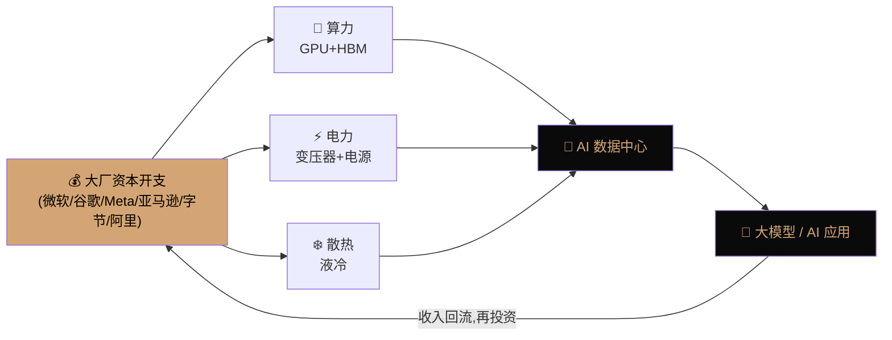
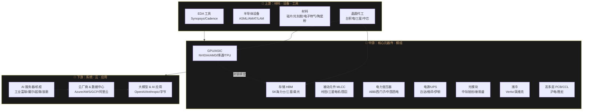
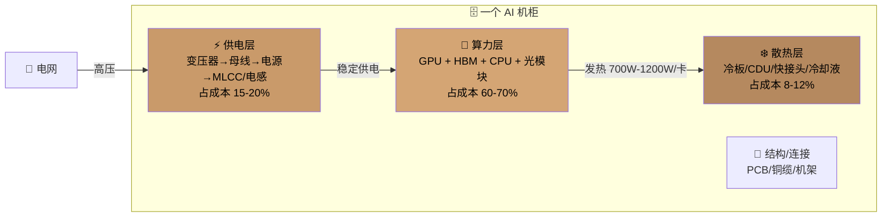
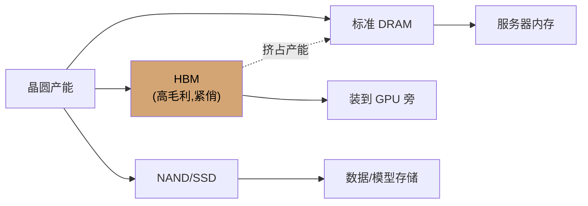
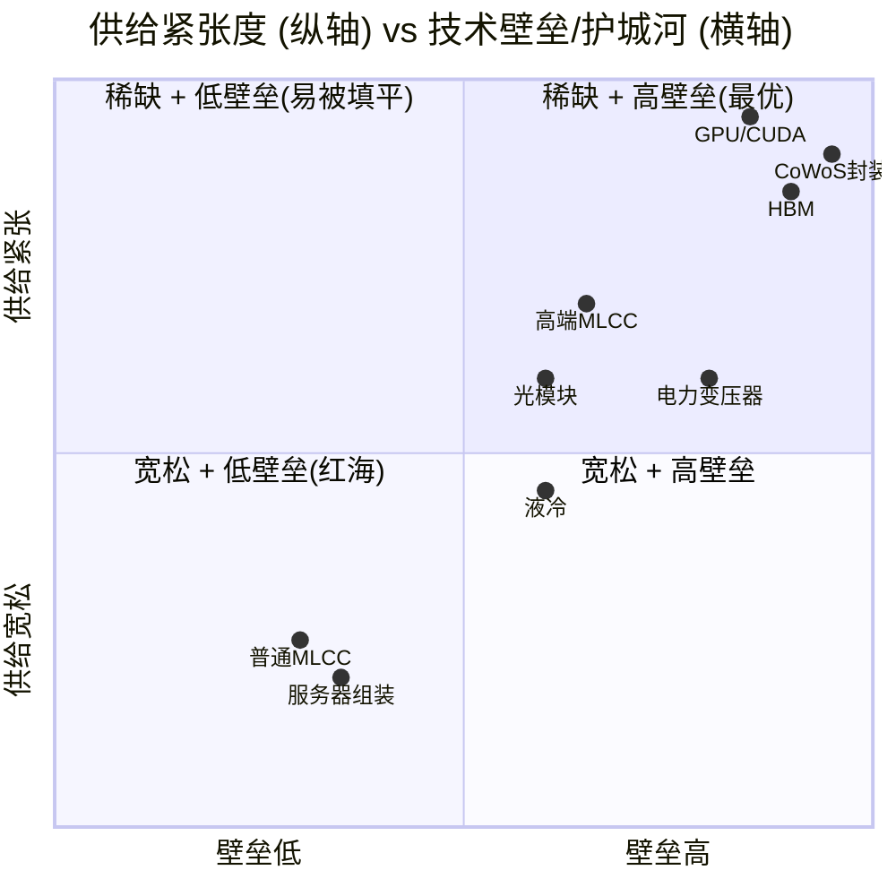
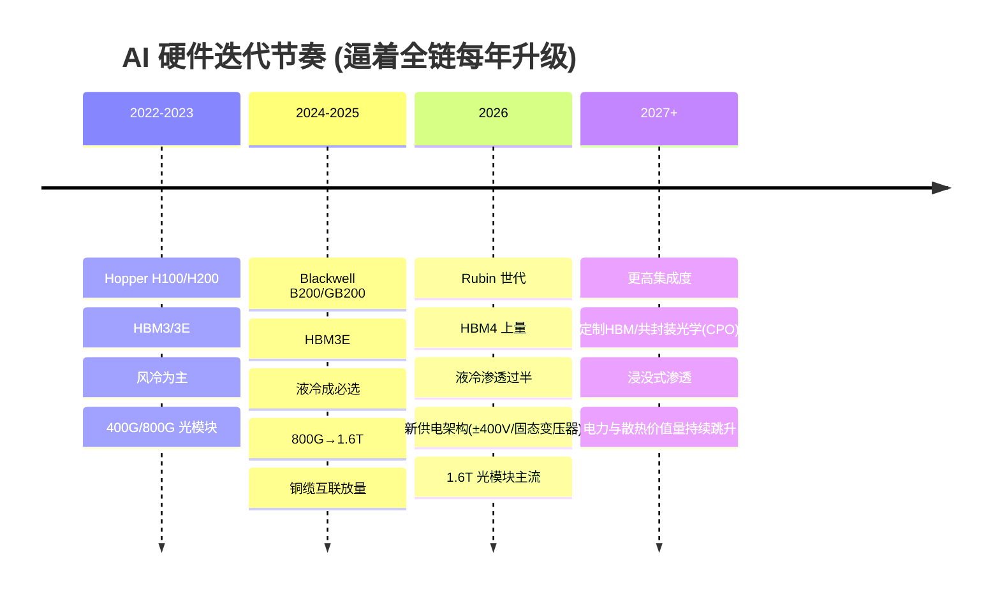
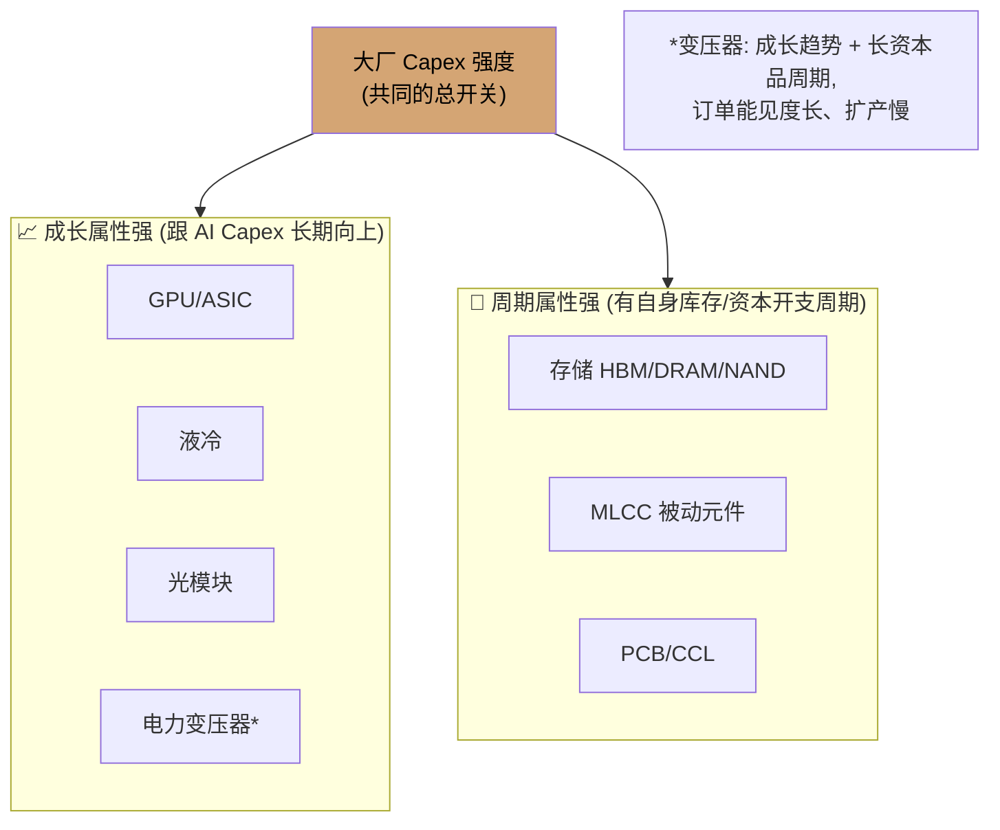
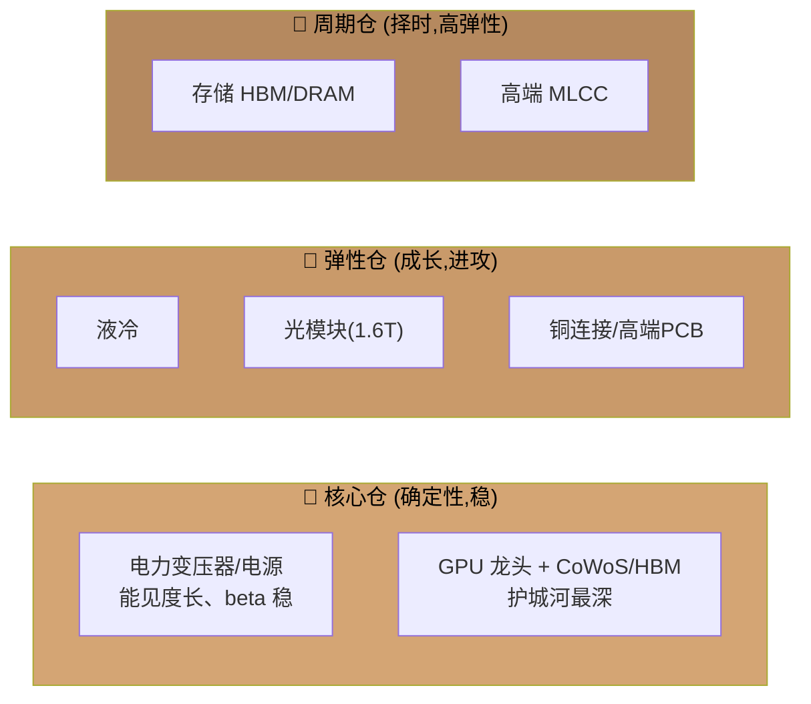

# AI 人工智能供应链全景解析

> 一份用于理解 AI 算力基础设施产业链的结构化文档：从 GPU、存储（HBM）到电力变压器、MLCC、液冷，讲清楚**上下游关系、供需格局、迭代前景、周期性**，并在结尾给出**资本市场投资建议**。
>
> 更新时点：2026 年年中。文中数据为量级判断与趋势描述，投资决策请以最新公司公告与财报为准。文末含风险与免责声明。

---

## 目录

1. [一句话主线](#1-一句话主线)
2. [产业链全景图（上中下游）](#2-产业链全景图上中下游)
3. [三大瓶颈层：算力 / 电力 / 散热](#3-三大瓶颈层算力--电力--散热)
4. [核心环节逐个拆解](#4-核心环节逐个拆解)
   - [4.1 GPU / AI 芯片](#41-gpu--ai-芯片算力大脑)
   - [4.2 存储：HBM / DRAM / NAND](#42-存储hbm--dram--nand算力的记忆)
   - [4.3 电力变压器](#43-电力变压器把电网的电喂进机房)
   - [4.4 MLCC 多层陶瓷电容](#44-mlcc-多层陶瓷电容电子工业大米)
   - [4.5 液冷](#45-液冷给算力降温)
   - [4.6 配角但关键：光模块 / PCB / 电源 / 铜连接](#46-配角但关键光模块--pcb--电源--铜连接)
5. [供需关系矩阵](#5-供需关系矩阵谁最紧张)
6. [迭代前景：技术路线图](#6-迭代前景技术路线图)
7. [周期性：这是成长股还是周期股？](#7-周期性这是成长股还是周期股)
8. [资本市场投资建议](#8-资本市场投资建议)
9. [风险与免责声明](#9-风险与免责声明)

---

## 1. 一句话主线

**AI 的本质是"用电力换智能"，而这个转换过程被三件事卡住脖子：算得快不快（GPU + HBM）、电够不够（变压器 + 电源）、热散不散得掉（液冷）。**

一台 AI 服务器 → 装进一个机柜 → 组成一个数据中心 → 由云厂商/大模型公司买单。整条链条上，**谁的产能扩不快、谁的技术门槛高，谁就能拿到超额利润**。当前的四个"堰塞湖"是：**CoWoS 先进封装、HBM、电力变压器、高端 MLCC**。

---

## 2. 产业链全景图（上中下游）

把 AI 硬件供应链切成**上游（材料/设备）— 中游（元器件/模组）— 下游（系统/应用）** 三段：

**关键读图法：**
- **越靠上游，技术垄断越强、毛利越高**（EDA、光刻机、CoWoS 几乎无替代）。
- **中游是"卖铲子"主战场**——GPU 之外，存储、被动元件、电力、散热都在这一层跟随放量。
- **下游资本开支（Capex）是整条链的"发动机"**：大厂每季度的 Capex 指引，就是全链条的需求晴雨表。

---

## 3. 三大瓶颈层：算力 / 电力 / 散热

一个 AI 机柜内部，钱花在三件事上。下图是"一个 GB200 级机柜的价值构成心智模型"：

**为什么这三层同时紧张？** 因为单卡功耗在飙升：

| 世代 | 代表卡 | 单卡功耗 | 单机柜功率 | 散热方式 |
|---|---|---|---|---|
| Ampere (2020) | A100 | ~400W | ~10-15kW | 风冷 |
| Hopper (2022) | H100 | ~700W | ~30-40kW | 风冷/风液混合 |
| Blackwell (2024-25) | B200/GB200 | ~1000-1200W | ~120kW+ | **必须液冷** |
| Rubin (2026+) | 规划中 | 更高 | ~200kW+ | 液冷+新供电架构 |

功耗每翻一倍，**电力和散热的价值量就跟着跳一个台阶**——这正是变压器、MLCC、液冷成为独立投资主线的根本原因。

---

## 4. 核心环节逐个拆解

### 4.1 GPU / AI 芯片（算力大脑）

- **是什么**：并行计算芯片，AI 训练/推理的核心。
- **格局**：NVIDIA 训练市场占 ~80-90%（护城河是 CUDA 软件生态 + NVLink 互联）；AMD（MI300/MI350）追赶；**自研 ASIC 崛起**——谷歌 TPU、亚马逊 Trainium/Inferentia、微软 Maia、Meta MTIA，博通/Marvell 是背后的定制芯片设计方。
- **上游**：台积电代工（唯一能大规模量产先进制程 + **CoWoS 先进封装**的厂），HBM 存储、ABF 载板。
- **供需**：长期供不应求，**真正的瓶颈不是晶圆而是 CoWoS 封装产能和 HBM 供给**。
- **迭代**：NVIDIA 转为"一年一代"节奏（Hopper→Blackwell→Rubin→…），逼迫全链每年升级。
- **一句话**：卖得最贵、护城河最深，但也是**估值最贵、预期最满**的环节。

### 4.2 存储：HBM / DRAM / NAND（算力的记忆）

存储是 AI 里最容易被低估的"隐形赢家"，分三块：

- **HBM（高带宽内存）** —— 直接堆叠在 GPU 旁边，喂数据给算力核心。**没有 HBM，GPU 就是"饿着的大脑"**。
  - 格局：SK 海力士领先，三星、美光（Micron）跟进，**三足鼎立**。
  - 供需：**极度紧张**，产能被提前一年以上锁定（sold out）。HBM 良率低、占用的晶圆产能是普通 DRAM 的数倍，进一步挤压标准内存供给。
  - 迭代：HBM3 → HBM3E → **HBM4**（2026 年上量，开始定制化 base die，绑定更深）。
- **服务器 DRAM** —— AI 服务器内存容量需求大增，HBM 挤占产能推高普通 DRAM 价格。
- **企业级 NAND / SSD** —— 存放训练数据、模型权重、推理缓存（KV cache）。AI 推理放量正在拉动**企业级 SSD** 需求。

- **周期性**：存储是**历史上最强周期的半导体品类**（"memory cycle"，繁荣—扩产—过剩—杀价—减产循环）。但这一轮 AI 需求把周期"拉平上移"，2024–2026 处于**涨价上行周期**。
- **一句话**：**存储是本轮 AI 里"周期+成长"共振最强的环节**，弹性可能大于 GPU。

### 4.3 电力变压器（把电网的电喂进机房）

- **是什么**：把电网高压电逐级降压、送进数据中心的电力设备。AI 数据中心是"电老虎"，一座大型 AI 数据中心的用电相当于一座小城市。
- **格局**：ABB、西门子能源、伊顿、GE Vernova（海外）；中国西电、金盘科技、华明装备（分接开关）、思源电气等（国内）。
- **供需**：**这是最"意外"的瓶颈**。全球电网老化 + AI 数据中心 + 电动车 + 制造业回流叠加，导致大型变压器**交货周期从几个月拉长到 1–2 年甚至更久**。产能受硅钢片、扩产周期长（重资产）限制。
- **迭代**：技术迭代慢（成熟工业品），核心变量是**产能扩张速度**，而非技术。
- **周期性**：**长周期资本品**，一旦进入上行周期，订单能见度长（在手订单排到数年后），但产能扩张也慢——**供需错配持续时间往往超预期**。
- **一句话**：**"AI 电力"是 2024 年以来最强的第二主线**，确定性高、beta 稳，属于"卖水人"里最稳的一档。

### 4.4 MLCC 多层陶瓷电容（"电子工业大米"）

- **是什么**：**多层陶瓷电容器（Multi-Layer Ceramic Capacitor）**，用于滤波、储能、稳压。任何电路板上都密密麻麻布满它——所以叫"电子工业大米"。
- **AI 逻辑**：AI 服务器/GPU 板卡因为**高功耗、高频、快速电流响应**，单板 MLCC 用量是普通服务器的数倍，且需要**高容量、高可靠的高端车规/服务器级 MLCC**。
- **格局**：日本村田（Murata，绝对龙头）、三星电机、太阳诱电、TDK；台湾国巨（Yageo）、华新科；大陆风华高科、三环集团（也做 MLCC 用陶瓷粉与瓷介）。
- **供需**：**普通 MLCC 是充分竞争的周期品，但高端高容 MLCC 供不应求**，产能集中在头部日厂。
- **周期性**：**典型的库存周期品**（涨价—客户囤货—需求透支—去库存—杀价），历史上波动大。AI 是结构性增量，但难改整体周期属性。
- **一句话**：**弹性大、但周期性强**，属于"跟随算力放量+自身库存周期"双重驱动，需择时。

### 4.5 液冷（给算力降温）

- **为什么突然火**：Blackwell 世代单机柜功率突破 ~120kW，**风冷物理上散不掉了**，液冷从"可选"变成"必选"。
- **技术路线**：
  - **冷板式（Cold Plate / D2C）**——液体流经贴在芯片上的冷板，当前主流、落地快。
  - **浸没式（Immersion）**——服务器泡在绝缘冷却液里，散热效率极高但改造成本大，渗透较慢。
- **价值链**：CDU（冷却液分配单元）、冷板、快接头（UQD）、Manifold 分液器、冷却液、二次侧管路。
- **格局**：Vertiv（维谛，海外龙头）、台达、Boyd；国内英维克、高澜股份、申菱环境、飞荣达（导热）等。
- **供需 & 前景**：**渗透率快速爬升**（从个位数向 AI 场景过半渗透），是**增速最快的环节之一**，但技术标准仍在演进、格局未完全固化。
- **一句话**：**高成长、强 beta，是"确定性放量"的黄金赛道**，但竞争者众、需甄别真正有份额和技术壁垒的公司。

### 4.6 配角但关键：光模块 / PCB / 电源 / 铜连接

| 环节 | 作用 | AI 逻辑 | 代表公司 |
|---|---|---|---|
| **光模块** | 服务器/交换机间高速光互联 | 800G→1.6T 快速迭代，用量随集群规模指数增长 | 中际旭创、新易盛、Coherent |
| **高多层 PCB / CCL** | 承载芯片的电路板/覆铜板 | AI 板层数暴增、材料升级（M8/M9 高频高速） | 沪电、胜宏、生益科技 |
| **电源 / 母线 / 电感** | 供电转换与分配 | 高功率密度电源、48V/±400V 新架构 | 台达、麦格米特、欧陆通 |
| **铜连接 / NVLink 铜缆** | 机柜内短距高速互联 | GB200 大量用铜缆替代光，DAC/ACC 放量 | 安费诺、沃尔核材、兆龙 |

---

## 5. 供需关系矩阵（谁最紧张？）

用"供给紧张度 × 技术壁垒"两个维度给核心环节定位：

**读图结论**：右上角（既稀缺又高壁垒）——**CoWoS、HBM、GPU**——是利润的"顶端捕食者"；**变压器、高端 MLCC、光模块**在中高位，是攻守兼备的第二梯队；**液冷**弹性大但壁垒待夯实；**服务器组装、普通被动件**靠走量、毛利薄。

### 供需状态速查表

| 环节 | 当前供需 | 瓶颈原因 | 缓解难度 |
|---|---|---|---|
| CoWoS 封装 | 🔴 极紧 | 台积电独家、扩产周期长 | 高 |
| HBM | 🔴 极紧 | 良率低、挤占晶圆 | 高 |
| 电力变压器 | 🔴 紧 | 重资产、硅钢/产能扩张慢 | 高 |
| 高端 MLCC | 🟠 偏紧 | 高容产能集中日厂 | 中 |
| 液冷 | 🟠 供需两旺 | 需求爆发>产能，但可扩 | 中 |
| 光模块 | 🟠 偏紧 | 高速产品良率/上量 | 中 |
| 企业级 SSD | 🟡 转紧 | 推理放量拉动 | 中 |
| 普通 MLCC / 组装 | 🟢 宽松 | 充分竞争 | 低 |

---

## 6. 迭代前景：技术路线图

**三条确定性趋势：**
1. **"一年一代"成常态** —— NVIDIA 节奏加快，全链条被动跟随升级，**旧产能快速贬值，技术领先者持续吃红利**。
2. **价值量向"电"和"热"转移** —— 芯片越强，配套的供电与散热价值量占比越高，**变压器/电源/液冷的市场增速快于服务器整机**。
3. **推理（Inference）接棒训练** —— 训练侧增长后，推理放量将拉动**企业级存储、边缘/推理芯片、能效比**成为下一阶段主线。

---

## 7. 周期性：这是成长股还是周期股？

**关键判断：AI 供应链是"成长赛道 × 不同环节的周期属性"叠加。** 不能一刀切。

- **成长股逻辑**（GPU、液冷、光模块）：估值高，看的是**渗透率和市占率**，Capex 只要不崩，趋势就在。
- **周期股逻辑**（存储、MLCC）：看的是**价格（涨价周期）+ 库存**，弹性最大但也最先见顶——**盈利拐点常领先股价，需盯住现货价与库存天数**。
- **共同的"总开关"**：**四大云厂商 + 主权 AI 的资本开支（Capex）**。这是判断整条链景气度的**最高频领先指标**——每个季度财报的 Capex 指引和"下季度是否上调"，比任何行业数据都重要。

**周期风险信号（需警惕）**：
- 大厂 Capex 增速放缓 / 指引下修；
- ROI 质疑（"AI 到底何时赚钱"引发投资节奏收敛）；
- 存储/MLCC 现货价格见顶回落、渠道库存回升；
- 电力/散热等瓶颈缓解 → 相关环节溢价收敛。

---

## 8. 资本市场投资建议

> ⚠️ 以下为**基于产业逻辑的框架性观点，非个股推荐、不构成投资建议**。请结合估值、财报与自身风险偏好独立决策。

### 8.1 配置框架：三档"卖铲人"组合

### 8.2 分环节观点

| 环节 | 观点 | 逻辑 | 主要风险 |
|---|---|---|---|
| **GPU / CoWoS / HBM** | ⭐⭐⭐⭐⭐ 长期核心 | 护城河最深、需求最刚 | 估值高、预期满、地缘/出口管制 |
| **电力（变压器/电源）** | ⭐⭐⭐⭐⭐ 首选"稳" | 供需错配持久、订单能见度长 | 电网投资节奏、产能释放 |
| **液冷** | ⭐⭐⭐⭐ 首选"攻" | 渗透率从低位快速爬升 | 竞争者众、标准演进、格局未定 |
| **光模块** | ⭐⭐⭐⭐ | 1.6T 迭代 + 集群规模 | CPO 替代路径、价格战 |
| **存储** | ⭐⭐⭐⭐ 周期弹性最大 | 周期+成长共振,上行期 | 强周期,拐点向下时杀跌快 |
| **高端 MLCC** | ⭐⭐⭐ 择时 | 跟随放量 | 库存周期、需求透支 |
| **PCB/铜连接** | ⭐⭐⭐ | 材料/层数升级 | 跟随属性、周期 |
| **服务器组装** | ⭐⭐ | 走量、卡位 | 毛利薄、议价弱 |

### 8.3 六条操作原则

1. **优先"卖铲人"而非"淘金者"** —— 应用层胜负未定，但**卖算力、卖电、卖散热的确定性更高**。
2. **盯住"总开关"** —— 每季度大厂 **Capex 指引**是全链最高频领先指标，上调就拿住、下修就减仓。
3. **成长仓拿趋势，周期仓做波段** —— GPU/液冷/变压器看渗透与订单可长持；存储/MLCC 要盯**现货价+库存天数**择时。
4. **警惕"最拥挤交易"** —— 共识最强、涨幅最大的环节，往往**预期最满、回调最深**；用估值分位数控制追高。
5. **在瓶颈里找 alpha** —— 真正稀缺（CoWoS、HBM、变压器）的环节议价力最强、盈利质量最高。
6. **左侧布局下一棒** —— 训练→**推理**切换将利好企业级存储、能效比、边缘推理芯片,可提前研究。

### 8.4 一句话总结

> **本轮 AI 是一场"算力—电力—散热"的三重军备竞赛。** 最稳的钱在**电（变压器/电源）**，最深的护城河在**芯（GPU/HBM/CoWoS）**，最快的成长在**冷（液冷）与联（光模块）**，最大的弹性在**存储与 MLCC 的周期共振**。核心风险只有一个名字——**大厂 Capex 何时降速**。跟住这个总开关，比研究任何单一环节都重要。

---

## 9. 风险与免责声明

- 本文为**产业知识梳理与投资框架**，**不构成任何证券、金融产品的投资建议或买卖要约**。
- 文中公司仅为**说明产业链环节的示例**，非推荐标的；提及不代表看多或看空。
- 数据与格局判断基于 2026 年年中公开信息与产业常识，**存在时效性**，可能与最新事实不符。
- AI 产业受**技术路线突变、宏观利率、地缘政治与出口管制、大厂资本开支波动**等多重因素影响，**周期环节尤其波动巨大**，投资有风险。
- 请以**上市公司正式公告、财报及持牌机构研究报告**为准，并咨询专业投资顾问后独立决策。

---

*本文档用 Mermaid 图表呈现关联关系，可在 GitHub 或任意支持 Mermaid 的 Markdown 阅读器中查看渲染效果。*
