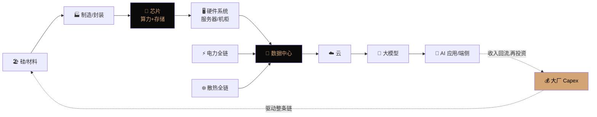
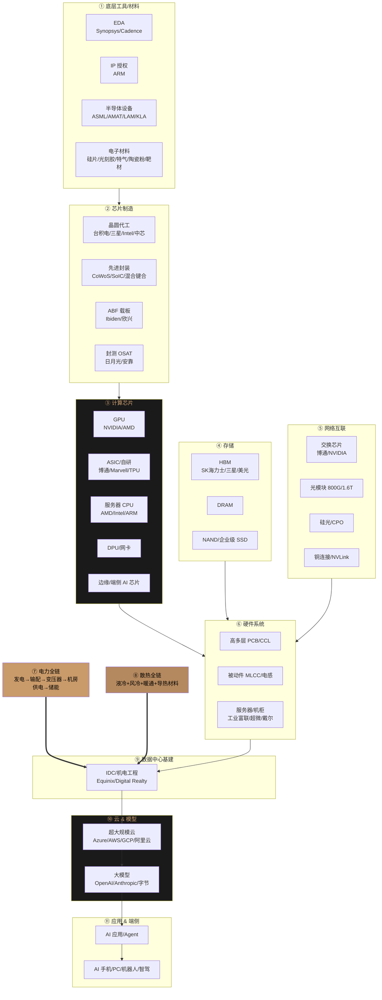
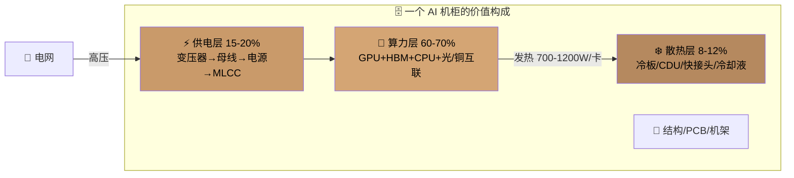
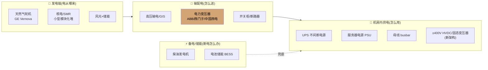
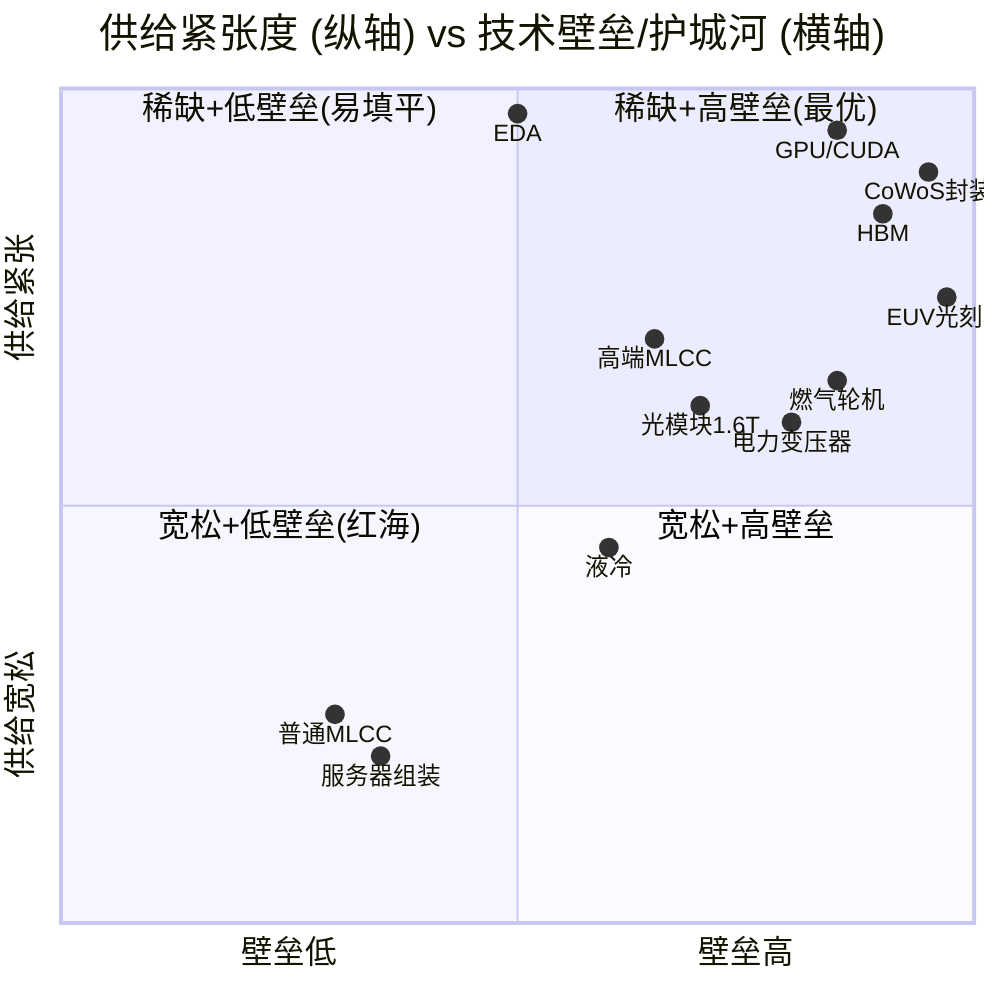
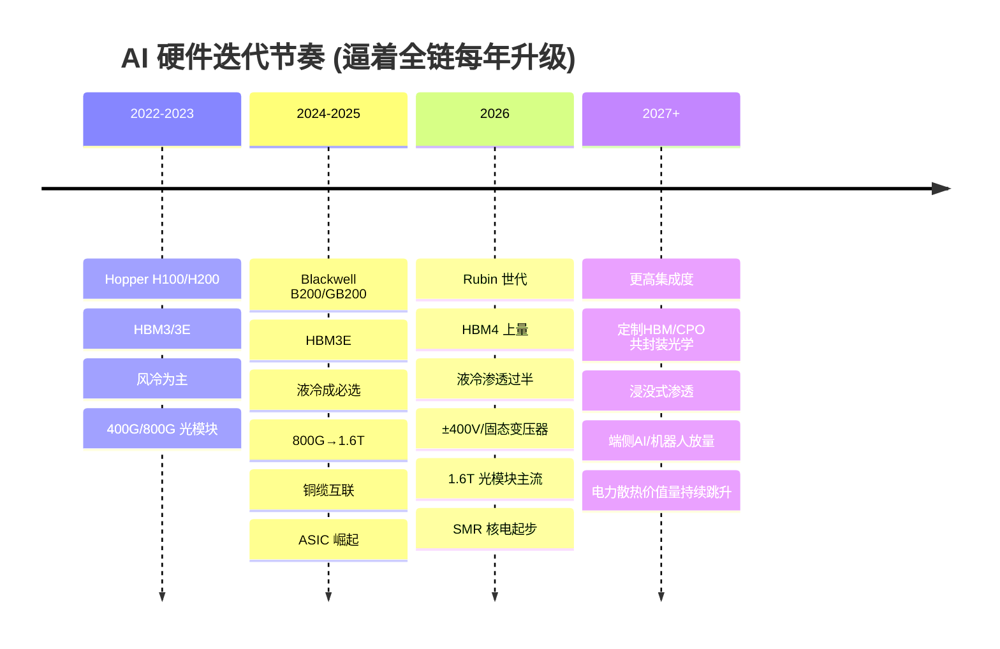
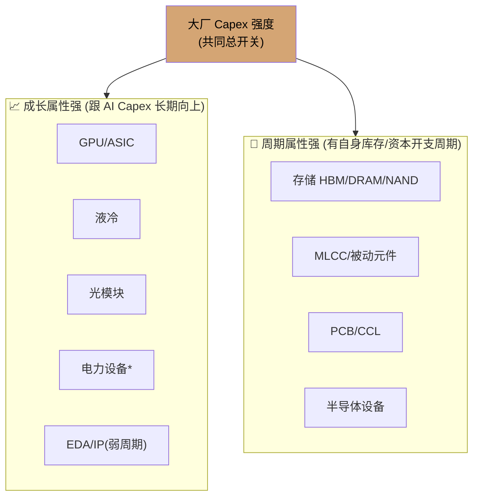
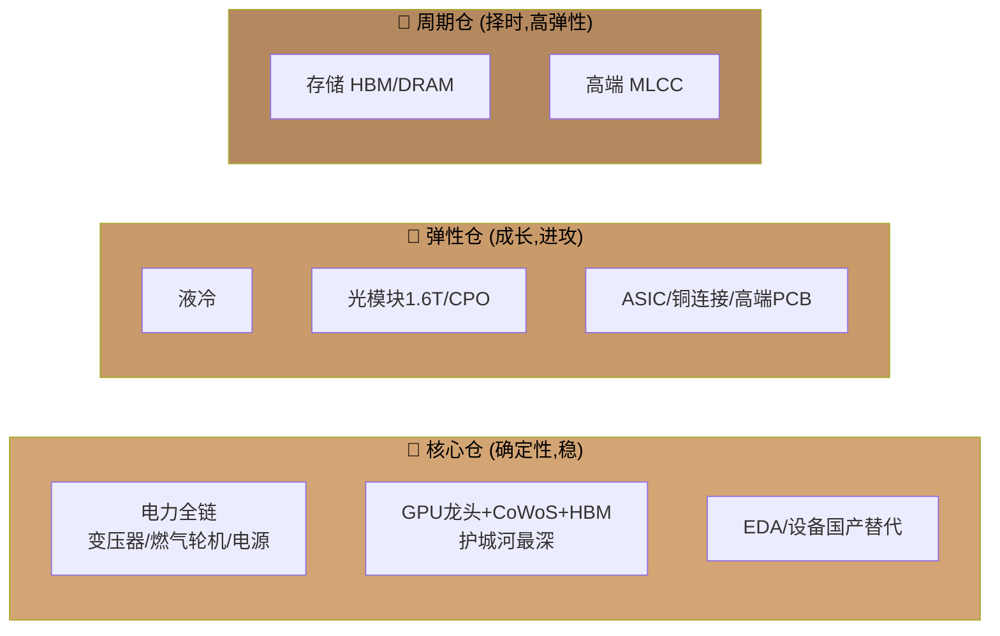

# AI 人工智能供应链全景解析（全栈版）

> 一份用于理解 AI 算力基础设施产业链的**结构化、全链条**文档：从最底层的 EDA/设备/材料，到芯片制造、计算与存储、网络互联、硬件系统、**电力全链、散热全链、数据中心基建**，直到下游云厂商、大模型与端侧应用。讲清楚每一环的**上下游关系、供需格局、迭代前景、周期性**，并在结尾给出**资本市场投资建议**。
>
> 更新时点：2026 年年中。文中数据为量级判断与趋势描述，投资决策请以最新公司公告与财报为准。文末含风险与免责声明。

---

## 目录

1. [一句话主线](#1-一句话主线)
2. [完整产业链全景（十一层全栈地图）](#2-完整产业链全景十一层全栈地图)
3. [价值集中点：三大瓶颈只是"利润高地"，不是全部](#3-价值集中点三大瓶颈只是利润高地不是全部)
4. [逐层拆解](#4-逐层拆解)
   - [4.1 底层：EDA / IP / 设备 / 材料](#41-底层eda--ip--设备--材料软件与工具垄断)
   - [4.2 制造：晶圆代工 / 先进封装 / 载板 / 封测](#42-制造晶圆代工--先进封装--载板--封测)
   - [4.3 计算芯片：GPU / ASIC / CPU / DPU / 边缘](#43-计算芯片gpu--asic--cpu--dpu--边缘)
   - [4.4 存储：HBM / DRAM / NAND](#44-存储hbm--dram--nand算力的记忆)
   - [4.5 网络互联：交换芯片 / 光模块 / CPO / 铜连接](#45-网络互联交换芯片--光模块--cpo--铜连接)
   - [4.6 硬件系统：PCB / 被动件(MLCC) / 服务器机柜](#46-硬件系统pcb--被动件mlcc--服务器机柜)
   - [4.7 电力全链：发电 → 输配电 → 变压器 → 机房供电 → 储能](#47-电力全链发电--输配电--变压器--机房供电--储能)
   - [4.8 散热全链：液冷 / 风冷 / 暖通 / 导热材料](#48-散热全链液冷--风冷--暖通--导热材料)
   - [4.9 数据中心基础设施](#49-数据中心基础设施地才是最终载体)
   - [4.10 下游：云 / 大模型 / 应用 / 端侧 / 机器人](#410-下游云--大模型--应用--端侧--机器人)
5. [供需关系矩阵](#5-供需关系矩阵谁最紧张)
6. [迭代前景：技术路线图](#6-迭代前景技术路线图)
7. [周期性：成长股还是周期股？](#7-周期性成长股还是周期股)
8. [资本市场投资建议](#8-资本市场投资建议)
9. [风险与免责声明](#9-风险与免责声明)

---

## 1. 一句话主线

**AI 的本质是"用电力换智能"，而这场军备竞赛需要一条极长的实体供应链来支撑——从沙子(硅)一路到智能。**

一粒硅 → 晶圆 → 芯片 → 封装 → 服务器 → 机柜 → 数据中心 → 云 → 大模型 → AI 应用。这条链上，**每一环都在被下游大厂的资本开支(Capex)拉动放量**；而**谁的产能扩不快、技术门槛高，谁就拿超额利润**。当前最紧的"堰塞湖"是 **CoWoS 先进封装、HBM、电力设备(变压器)、高端 MLCC**——但它们只是利润高地，**完整的产业链有十一层，每层都有投资机会与风险**。

---

## 2. 完整产业链全景（十一层全栈地图）

这是本文的核心总览图。整条 AI 供应链可拆成**十一个环节**，纵向从上游到下游，横向并列"电力"与"散热"两条贯穿始终的支撑链：

**读图法：** ①②靠上游、垄断强、毛利高；③④⑤⑥是"卖铲子"主战场；⑦⑧是贯穿全程的支撑链(价值量随功耗跳升)；⑨⑩⑪是需求发动机。

---

## 3. 价值集中点：三大瓶颈只是"利润高地"，不是全部

虽然产业链有十一层，但**钱和利润高度集中在三件事上**——这是理解全局的"心智锚点"，但不要因此忽略其余环节的机会：

**驱动力：单卡功耗在飙升**，把电力与散热从"配角"顶成了独立主线：

| 世代 | 代表卡 | 单卡功耗 | 单机柜功率 | 散热方式 |
|---|---|---|---|---|
| Ampere (2020) | A100 | ~400W | ~10-15kW | 风冷 |
| Hopper (2022) | H100 | ~700W | ~30-40kW | 风冷/风液混合 |
| Blackwell (2024-25) | B200/GB200 | ~1000-1200W | ~120kW+ | **必须液冷** |
| Rubin (2026+) | 规划中 | 更高 | ~200kW+ | 液冷+新供电架构 |

---

## 4. 逐层拆解

### 4.1 底层：EDA / IP / 设备 / 材料（软件与工具垄断）

产业链最上游，**技术垄断最强、毛利最高、最难被替代**。

| 环节 | 作用 | 格局 | 供需/壁垒 |
|---|---|---|---|
| **EDA 工具** | 芯片设计软件(没有它设计不出芯片) | Synopsys、Cadence、Siemens EDA **三家垄断** | 极高壁垒，软件+生态锁定 |
| **IP 授权** | 可复用电路模块 | ARM(CPU 架构)、各类接口 IP | 高，架构标准锁定 |
| **半导体设备** | 造芯片的机器 | **ASML(光刻机唯一 EUV)**、AMAT、Lam、KLA、东京电子 | 极高，EUV 全球独家 |
| **电子材料** | 硅片/光刻胶/电子特气/CMP/靶材/**MLCC 陶瓷粉** | 信越、SUMCO、JSR、东京应化;陶瓷粉体日企主导 | 中-高，部分国产替代进行中 |

- **供需**：EUV 光刻机、高端光刻胶长期紧张；国产替代是中国市场的独立主题。
- **周期**：设备是**半导体资本开支周期品**，跟晶圆厂扩产节奏走；EDA/IP 是**软件订阅型**，最稳、弱周期。
- **一句话**：**"卖铲人的卖铲人"，确定性最高但估值也最贵**；国产替代是 A 股独立 alpha。

### 4.2 制造：晶圆代工 / 先进封装 / 载板 / 封测

芯片从设计变成实物的环节，**当前最硬的瓶颈就在这里**。

- **晶圆代工**：台积电在先进制程(3nm/5nm)近乎垄断，三星、Intel Foundry 追赶，中芯国际是国产主力(受制程限制)。
- **先进封装(CoWoS/SoIC)**：把 GPU 芯粒和 HBM 集成到一起的关键工艺。**真正卡 GPU 出货的不是晶圆而是 CoWoS 产能**，台积电独家、扩产周期长——**全链第一大堰塞湖**。混合键合(hybrid bonding)是下一代方向。
- **ABF 载板**：承载芯片的高端基板，Ibiden、欣兴、揖斐电等主导，AI 芯片放量拉动高端载板。
- **封测 OSAT**：日月光、安靠、通富微电等，承接部分封装+测试。
- **供需**：CoWoS 极紧、载板偏紧、成熟封测宽松。
- **周期**：代工/封装是**重资产资本品**，扩产慢、订单能见度长。
- **一句话**：**CoWoS 是整条 AI 链稀缺性最高的环节之一**，议价力极强。

### 4.3 计算芯片：GPU / ASIC / CPU / DPU / 边缘

算力大脑，不止 GPU：

- **GPU**：NVIDIA 训练市场占 ~80-90%(护城河=CUDA 软件生态+NVLink 互联)；AMD(MI300/MI350)追赶。
- **ASIC / 自研芯片**：谷歌 TPU、亚马逊 Trainium/Inferentia、微软 Maia、Meta MTIA——**大厂用自研 ASIC 降本、摆脱对 NVIDIA 依赖**，背后设计方是**博通、Marvell**(定制芯片是这两家的高增长业务)。
- **服务器 CPU**：AI 服务器仍需 CPU 做调度，AMD EPYC、Intel Xeon、以及 ARM 架构(NVIDIA Grace、云厂自研)。
- **DPU / 网卡(NIC)**：卸载网络/存储任务，NVIDIA(BlueField)、博通、Marvell。
- **边缘/端侧 AI 芯片**：手机/PC/汽车/机器人上的 NPU，高通、联发科、苹果、地平线等——**推理下沉到端侧是下一波增量**。
- **供需**：训练 GPU 极紧；ASIC 结构性崛起；边缘芯片放量在即。
- **一句话**：GPU 护城河最深、估值最贵；**ASIC 是"去 NVIDIA 化"的确定性趋势**；边缘是最长的雪坡。

### 4.4 存储：HBM / DRAM / NAND（算力的记忆）

最容易被低估的"隐形赢家"：

- **HBM(高带宽内存)**：堆叠在 GPU 旁喂数据，**没有 HBM，GPU 就是"饿着的大脑"**。SK 海力士领先，三星、美光三足鼎立。**极度紧张、产能提前一年以上锁定**；良率低、挤占普通 DRAM 晶圆产能。迭代：HBM3E → **HBM4**(2026 上量，定制 base die，绑定更深)。
- **服务器 DRAM**：AI 服务器大内存需求 + HBM 挤占产能 → 涨价。
- **企业级 NAND/SSD**：存训练数据、模型权重、推理 KV cache。**推理放量正拉动企业级 SSD**。
- **周期性**：存储是**历史最强周期的半导体品类**(memory cycle)，但这一轮被 AI 需求"拉平上移"，2024-2026 处于**上行周期**。
- **一句话**：**"周期+成长"共振最强，弹性可能大于 GPU**，但要盯现货价与库存拐点。

### 4.5 网络互联：交换芯片 / 光模块 / CPO / 铜连接

大模型要几万张卡协同，**"连接"本身就是巨大市场**：

| 环节 | 作用 | 格局 | AI 逻辑 |
|---|---|---|---|
| **交换芯片** | 数据中心交换机核心 | 博通(Tomahawk/Jericho)、NVIDIA(Spectrum/InfiniBand) | 集群规模越大用量越大 |
| **光模块** | 服务器/交换机间光互联 | 中际旭创、新易盛、Coherent | 800G→**1.6T** 快速迭代，用量随集群指数增长 |
| **光芯片/硅光/CPO** | 光模块内的激光器/共封装光学 | EML/DFB 激光器、硅光 | **CPO(共封装光学)** 是降功耗的下一代路径 |
| **铜连接/NVLink 铜缆** | 机柜内短距高速互联 | 安费诺、沃尔核材、兆龙 | GB200 大量用铜缆(DAC/ACC)替代光 |

- **供需**：高速光模块偏紧、铜连接放量。
- **一句话**：**光模块是 A 股 AI 最强主线之一**；CPO/硅光是技术拐点，需跟踪替代节奏。

### 4.6 硬件系统：PCB / 被动件(MLCC) / 服务器机柜

把芯片组装成可用系统：

- **高多层 PCB / CCL 覆铜板**：AI 板层数暴增、材料升级(M8/M9 高频高速)。沪电、胜宏、生益科技。
- **被动元件**：
  - **MLCC(多层陶瓷电容,"电子工业大米")**：滤波/储能/稳压，任何板上都密布。AI 服务器/GPU 板卡因**高功耗、高频、快速电流响应**，单板用量是普通服务器数倍，需**高容量高可靠**的高端 MLCC。村田(Murata,龙头)、三星电机、太阳诱电、TDK;台湾国巨、华新科;大陆风华高科、三环集团。**普通 MLCC 是周期红海，高端高容供不应求。**
  - 电感、电阻等同步放量。
- **服务器/机柜整机**：ODM(工业富联、广达、纬创、超微)、品牌(戴尔、HPE、浪潮)。**毛利薄、走量、议价弱**。
- **周期性**：MLCC/PCB 是**典型库存周期品**(涨价→囤货→透支→去库存→杀价)，AI 是结构性增量但难改周期属性。
- **一句话**：高端 MLCC/PCB **弹性大但需择时**；整机组装是卡位型、赚辛苦钱。

### 4.7 电力全链：发电 → 输配电 → 变压器 → 机房供电 → 储能

**这是超越"变压器"单点、被严重低估的一整条链**。AI 数据中心是"电老虎"，一座大型 AI 数据中心用电堪比一座小城市，**"电从哪来、怎么送进机房、断电怎么办"是三个独立大市场**：

- **发电端**：AI 用电缺口大，**天然气轮机(GE Vernova)订单爆满、核电/SMR(小型模块化反应堆)成新宠**，大厂签长期购电协议(PPA)。
- **输配电**：**电力变压器是最"意外"的瓶颈**——电网老化+AI+电动车+制造业回流叠加，大型变压器**交货期从几个月拉到 1-2 年**，硅钢片/产能扩张慢。ABB、西门子能源、伊顿、GE Vernova;中国西电、金盘科技、华明装备、思源电气。
- **机房内供电**：高功率密度电源、母线、**48V/±400V 新供电架构、固态变压器**是技术升级方向。台达、维谛、伊顿、麦格米特、欧陆通。
- **备电/储能**：柴油发电机 + **电池储能(BESS)** 做削峰填谷与备电。
- **周期性**：电力设备是**长资本品周期**，一旦上行订单能见度长(排到数年)，但扩产也慢——**供需错配持续时间常超预期**。
- **一句话**：**"AI 电力"是 2024 年以来最强第二主线，确定性高、beta 最稳**;变压器、燃气轮机、电源是核心受益。

### 4.8 散热全链：液冷 / 风冷 / 暖通 / 导热材料

功耗暴增让散热从"辅助"变"刚需"，是一整条链而非只有液冷：

- **液冷(增速最快)**：单机柜破 ~120kW 后**风冷物理上散不掉**，液冷成必选。
  - **冷板式(Cold Plate/D2C)**：主流、落地快；**浸没式(Immersion)**：效率极高但改造成本大、渗透慢。
  - 价值链：CDU(冷却液分配单元)、冷板、快接头(UQD)、Manifold、冷却液、二次侧管路。
  - 格局：Vertiv(维谛)、台达、Boyd;英维克、高澜股份、申菱环境。
- **风冷仍在**：风扇、散热片、**热管/均热板(VC)**——中低功耗与端侧仍用。
- **数据中心暖通(HVAC)**：冷水机组(chiller)、冷却塔、精密空调——整栋楼的热管理。
- **导热材料(TIM)**：芯片与散热器间的导热界面材料,飞荣达等。
- **供需/前景**：液冷**渗透率快速爬升**(向 AI 场景过半渗透)，是增速最快环节之一,但标准仍在演进、格局未固化。
- **一句话**：**液冷=高成长强 beta 的黄金赛道**,但竞争者众,要甄别真正有份额与技术壁垒者。

### 4.9 数据中心基础设施（"地"才是最终载体）

芯片、电、冷最终都要装进一栋楼：

- **IDC 运营/机电工程**：Equinix、Digital Realty(海外 REITs);国内三大运营商、万国数据、世纪互联。
- **建筑与机电总包**：数据中心建设(EPC)、结构、配电、消防。
- **稀缺要素**：**电力接入(能否拿到电)、土地/选址、水资源(冷却用水)**——AI 时代"有地有电"本身就是壁垒。
- **一句话**：**"卖地皮+卖电力接入"是重资产但现金流稳的生意**,选址靠近廉价电力是核心竞争力。

### 4.10 下游：云 / 大模型 / 应用 / 端侧 / 机器人

需求的最终发动机：

- **超大规模云(Hyperscalers)**：微软 Azure、AWS、谷歌云、Meta、字节、阿里云、腾讯云——**它们的 Capex 是全链最高频领先指标**。
- **大模型公司**：OpenAI、Anthropic、谷歌、Meta、xAI、字节、阿里、DeepSeek——烧钱训练、竞争激烈,**商业化 ROI 是市场最大分歧点**。
- **AI 软件/框架**：CUDA(NVIDIA 护城河)、PyTorch、推理框架、AI 云原生。
- **AI 应用/Agent**：企业软件、编程助手、AI Agent——**推理需求的真正来源**。
- **端侧 AI**：AI 手机/PC、**人形机器人、自动驾驶**——把推理算力铺到物理世界,是最长的雪坡。
- **一句话**：**应用层胜负未定、格局最不清晰**;但它是判断"AI 到底能不能赚钱、Capex 能不能持续"的最终答案。

---

## 5. 供需关系矩阵（谁最紧张？）

用"供给紧张度 × 技术壁垒"两个维度给核心环节定位：

### 供需状态速查表（全环节）

| 环节 | 当前供需 | 瓶颈原因 | 缓解难度 |
|---|---|---|---|
| EUV 光刻机 | 🔴 极紧 | ASML 独家、产能有限 | 高 |
| CoWoS 封装 | 🔴 极紧 | 台积电独家、扩产慢 | 高 |
| HBM | 🔴 极紧 | 良率低、挤占晶圆 | 高 |
| 电力变压器/燃气轮机 | 🔴 紧 | 重资产、扩产周期长 | 高 |
| 高端 MLCC | 🟠 偏紧 | 高容产能集中日厂 | 中 |
| 高速光模块 | 🟠 偏紧 | 良率/上量 | 中 |
| 液冷 | 🟠 供需两旺 | 需求爆发>产能 | 中 |
| 企业级 SSD | 🟡 转紧 | 推理放量拉动 | 中 |
| ABF 载板 | 🟡 偏紧 | 高端产能 | 中 |
| 普通 MLCC/PCB/组装 | 🟢 宽松 | 充分竞争 | 低 |

---

## 6. 迭代前景：技术路线图

**四条确定性趋势：**
1. **"一年一代"成常态** —— NVIDIA 节奏逼全链每年升级,旧产能快速贬值,**技术领先者持续吃红利**。
2. **价值量向"电"和"热"转移** —— 芯片越强,配套供电与散热价值量占比越高,**变压器/电源/液冷增速快于服务器整机**。
3. **推理(Inference)接棒训练** —— 推理放量拉动**企业级存储、能效比、边缘/推理芯片**成为下一阶段主线。
4. **"去 NVIDIA 化"与国产替代** —— ASIC 自研芯片、国产设备/材料/EDA 是长期结构性主题。

---

## 7. 周期性：成长股还是周期股？

**关键判断：AI 供应链是"成长赛道 × 不同环节的周期属性"叠加,不能一刀切。**

- **成长股逻辑**(GPU/液冷/光模块/电力)：看**渗透率与市占率**,Capex 不崩趋势就在,估值高。
- **周期股逻辑**(存储/MLCC/PCB/设备)：看**价格(涨价周期)+库存**,弹性最大也最先见顶——**盈利拐点常领先股价,盯现货价与库存天数**。
- **共同"总开关"**：**四大云厂+主权 AI 的资本开支(Capex)**。每季财报的 Capex 指引与"是否上调",比任何行业数据都重要。

**周期风险信号(需警惕)**：大厂 Capex 增速放缓/指引下修 · ROI 质疑引发投资收敛 · 存储/MLCC 现货价见顶回落、库存回升 · 电力/散热瓶颈缓解致溢价收敛。

---

## 8. 资本市场投资建议

> ⚠️ 以下为**基于产业逻辑的框架性观点,非个股推荐、不构成投资建议**。请结合估值、财报与自身风险偏好独立决策。

### 8.1 配置框架：三档"卖铲人"组合

### 8.2 分环节观点（全景）

| 环节 | 观点 | 逻辑 | 主要风险 |
|---|---|---|---|
| **GPU/CoWoS/HBM** | ⭐⭐⭐⭐⭐ 长期核心 | 护城河最深、需求最刚 | 估值高、预期满、出口管制 |
| **电力全链(变压器/燃气轮机/电源)** | ⭐⭐⭐⭐⭐ 首选"稳" | 供需错配持久、订单能见度长 | 电网投资节奏、产能释放 |
| **EDA/设备/材料** | ⭐⭐⭐⭐ 最高壁垒 | 垄断+国产替代双主题 | 周期波动、地缘 |
| **液冷** | ⭐⭐⭐⭐ 首选"攻" | 渗透率快速爬升 | 竞争者众、标准演进 |
| **光模块/CPO** | ⭐⭐⭐⭐ | 1.6T 迭代+集群规模 | CPO 替代路径、价格战 |
| **ASIC/自研芯片** | ⭐⭐⭐⭐ | 去 NVIDIA 化确定性 | 单客户依赖 |
| **存储** | ⭐⭐⭐⭐ 弹性最大 | 周期+成长共振,上行期 | 强周期,拐点杀跌快 |
| **高端 MLCC/PCB** | ⭐⭐⭐ 择时 | 跟随放量 | 库存周期、需求透支 |
| **数据中心/IDC** | ⭐⭐⭐ | 有电有地即壁垒 | 重资产、电价 |
| **服务器组装** | ⭐⭐ | 走量卡位 | 毛利薄、议价弱 |
| **大模型/应用** | ⭐⭐-⭐⭐⭐ 分歧大 | 长期空间大 | 商业化 ROI 未证明 |

### 8.3 六条操作原则

1. **优先"卖铲人"而非"淘金者"** —— 应用层胜负未定,**卖算力、卖电、卖散热的确定性更高**。
2. **盯住"总开关"** —— 每季大厂 **Capex 指引**是全链最高频领先指标,上调拿住、下修减仓。
3. **成长仓拿趋势,周期仓做波段** —— GPU/液冷/电力看渗透与订单可长持;存储/MLCC 盯**现货价+库存天数**择时。
4. **警惕"最拥挤交易"** —— 共识最强、涨幅最大的环节往往**预期最满、回调最深**,用估值分位控制追高。
5. **在瓶颈里找 alpha** —— 真正稀缺(CoWoS/HBM/变压器/EUV)议价力最强、盈利质量最高。
6. **左侧布局下一棒** —— 训练→**推理→端侧/机器人**切换,利好企业级存储、能效比、边缘芯片、机器人产业链。

### 8.4 一句话总结

> **本轮 AI 是一场贯穿"硅→芯→电→冷→云→端"的全链军备竞赛。** 最深的护城河在**芯(GPU/HBM/CoWoS/EDA)**,最稳的钱在**电(变压器/燃气轮机/电源)**,最快的成长在**冷(液冷)与联(光模块/ASIC)**,最大的弹性在**存储与 MLCC 的周期共振**,最长的雪坡在**端侧与机器人**。而核心风险只有一个名字——**大厂 Capex 何时降速**。跟住这个总开关,比研究任何单一环节都重要。

---

## 9. 风险与免责声明

- 本文为**产业知识梳理与投资框架**,**不构成任何证券、金融产品的投资建议或买卖要约**。
- 文中公司仅为**说明产业链环节的示例**,非推荐标的;提及不代表看多或看空。
- 数据与格局判断基于 2026 年年中公开信息与产业常识,**存在时效性**,可能与最新事实不符。
- AI 产业受**技术路线突变、宏观利率、地缘政治与出口管制、大厂资本开支波动**等多重因素影响,**周期环节尤其波动巨大**,投资有风险。
- 请以**上市公司正式公告、财报及持牌机构研究报告**为准,并咨询专业投资顾问后独立决策。

---

*本文档用 Mermaid 图表呈现关联关系,可在 GitHub 或任意支持 Mermaid 的 Markdown 阅读器中查看渲染效果。*
